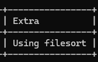

# mysql中的数据排序怎么实现
mysql命中索引索引排序否则文件排序

## 文件排序
如果数据量小，单路排序或双路排序

### 单路排序
所有数据一次性加载到内存,在内存中排序

### 双路排序
两次磁盘I/O

1. 将数据分成多个小块,每块在内存中排序后写入临时文件
2. 读取临时文件中的所有数据,进行多路归并排序

触发条件:
- 数据量较大,超过`sort_buffer_size`
- 排序字段长度较长,超过`max-length_for_sort_data`(4096字节)
- 查询优化器认为双路排序更适合当前的查询

文件排序使用explain可以知道是file sort


加入索引后,由于数据量小,查询优化器认为全表扫描比索引更快,因此加入`FORCE INDEX`
```sql
EXPLAIN SELECT * FROM user FORCE INDEX (index_age) ORDER BY age;
```
