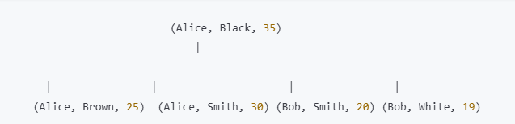

# 原则
使用联合索引的时候，查询条件必须从索引的最左侧开始匹配，如果一个联合索引包含多个列，查询条件必须包含第一个列的条件，然后第二个……

## 底层
联合索引在B+树中排列方式遵循从左到右的顺序，(first_name, last_name, age) 会按照(first_name, last_name, age)的顺序在B+树中排序


## eg
假设当前表有一个联合索引(a,b,c)
```sql
where a=1;
where a=1, b=2;
where a=1, b=2, c=3;
```